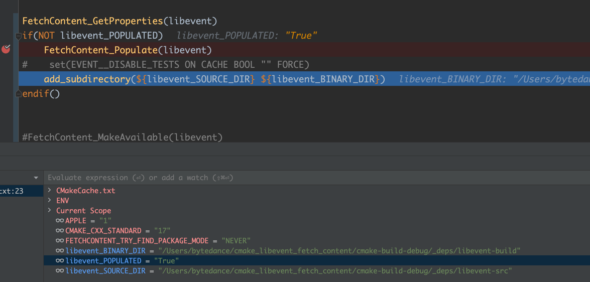

# find_package

1. 定义 CmakeLists.txt

```cmake
cmake_minimum_required (VERSION 3.12)

set (CMAKE_CXX_STANDARD 17)
project (main)

# 1. 根据 CMAKE_PREFIX_PATH 获取 libevent 配置, mac/linux 上是 /usr/local/lib/cmake
find_package (libevent REQUIRED)

# 2. 发现成功后会注入以下几个配置
message (libevent_FOUND: "${libevent_FOUND}")
message (libevent_VERSION: "${libevent_VERSION}")
message (libevent_DIR: "${libevent_DIR}")
message (libevent_CONFIG: "${libevent_CONFIG}")

# 3. 读取配置文件 "${libevent_CONFIG}" =  /usr/local/lib/cmake/libevent/libeventConfig.cmake
# 其中 LibeventConfig.cmake 会有以下几个配置
message (libevent_INCLUDE_DIRS: "${LIBEVENT_INCLUDE_DIRS}")
message (libevent_INCLUDE_DIRS: "${LIBEVENT_STATIC_LIBRARIES}")
message (libevent_INCLUDE_DIRS: "${LIBEVENT_SHARED_LIBRARIES}")

# 4. 正常的配置一个 c++ 可执行文件
add_executable (main)
target_sources (main PRIVATE main.cpp)
target_include_directories (main PRIVATE ${CMAKE_SOURCE_DIR} ${LIBEVENT_INCLUDE_DIRS})
target_link_libraries (main PRIVATE ${LIBEVENT_STATIC_LIBRARIES})
```

2. main.cpp

```cpp
#include <iostream>
#include <event2/event.h>


int main()
{
    auto event_base = event_base_new();

    auto timeout = timeval{.tv_sec = 1, .tv_usec = 0};
    std::string event_name = "test";
    auto event = event_new(event_base, 0, EV_TIMEOUT | EV_PERSIST, [](evutil_socket_t soekct, short event, void* args)
    {
        std::string* event_name = static_cast<std::string*>(args);
        auto now = std::chrono::system_clock::now();
        std::cout << std::chrono::duration_cast<std::chrono::seconds>(now.time_since_epoch()).count() <<
            " - tigger event: " << *event_name << "\n";
    }, &event_name);

    event_add(event, &timeout);
    event_base_dispatch(event_base);
    event_base_free(event_base);
}

```

3. cmake 编译

```shell
libevent_FOUND:1
libevent_VERSION:2.1.10
libevent_DIR:/usr/local/lib/cmake/libevent
libevent_CONFIG:/usr/local/lib/cmake/libevent/libeventConfig.cmake
libevent_INCLUDE_DIRS:/usr/local/lib/cmake/libevent/../../../include
libevent_INCLUDE_DIRS:event_core_static;event_extra_static;event_openssl_static;event_pthreads_static;event_static
libevent_INCLUDE_DIRS:event_core_shared;event_extra_shared;event_openssl_shared;event_pthreads_shared;event_shared
-- Configuring done (0.0s)
-- Generating done (0.0s)
-- Build files have been written to: /Users/bytedance/cmake_libevent/cmake-build-debug 
```

4. 执行成功

```shell
1712476073 - tigger event: test
1712476074 - tigger event: test
1712476075 - tigger event: test 
```

# FetchContent 

1. FetchContent 使用起来会更加的现代化

```cmake
cmake_minimum_required(VERSION 3.12)

set(CMAKE_CXX_STANDARD 17)
project(cmake_libevent_fetch_content)

if (APPLE)
    set(FETCHCONTENT_TRY_FIND_PACKAGE_MODE NEVER) # mac 上禁止使用
endif ()

cmake_policy(SET CMP0135 NEW)

# 加载 FetchContent
include(FetchContent)

# 申明 libevent 远程(注意：需要2.1.12版本以上，2.1.10版本我试过不行)
FetchContent_Declare(
        libevent
        URL https://github.com/libevent/libevent/archive/refs/tags/release-2.1.12-stable.tar.gz
)

# 加载 libevent
FetchContent_MakeAvailable(libevent)

add_executable(main)
target_sources(main PRIVATE main.cpp)
target_include_directories(main PRIVATE ${CMAKE_SOURCE_DIR})
target_link_libraries(main PRIVATE event)
```


2. FetchContent_MakeAvailable 实际上等价于 FetchContent_Populate + add_subdirectory

```shell
cmake_minimum_required(VERSION 3.12)

set(CMAKE_CXX_STANDARD 17)
project(cmake_libevent_fetch_content)

if (APPLE)
    set(FETCHCONTENT_TRY_FIND_PACKAGE_MODE NEVER) # mac 上禁止使用
endif ()

cmake_policy(SET CMP0135 NEW)

include(FetchContent)
FetchContent_Declare(
        libevent
        URL https://github.com/libevent/libevent/archive/refs/tags/release-2.1.12-stable.tar.gz
        FIND_PACKAGE_ARGS libevent
)

FetchContent_GetProperties(libevent)
if(NOT libevent_POPULATED)
    FetchContent_Populate(libevent)
#    set(EVENT__DISABLE_TESTS ON CACHE BOOL "" FORCE)
    add_subdirectory(${libevent_SOURCE_DIR} ${libevent_BINARY_DIR})
endif()


#FetchContent_MakeAvailable(libevent)

add_executable(main)
target_sources(main PRIVATE main.cpp)
target_include_directories(main PRIVATE ${CMAKE_SOURCE_DIR})
target_link_libraries(main PRIVATE event)
```




3. 总结

因此我们可以类似于 bazel 一样，很骚的操作去修改一个下载的包，比如libevent不支持camke，我们可以下载下来后给他改成支持camke！
实际上我们在camke中使用asio就是使用的这个做法！


# 总结

1. find_package 比较适合与自己本地写项目，或者一些公共的库，比如openssl等！
2. FetchContent 比较灵活，适用于各种场景！
